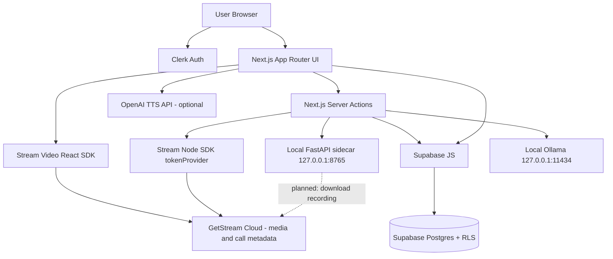
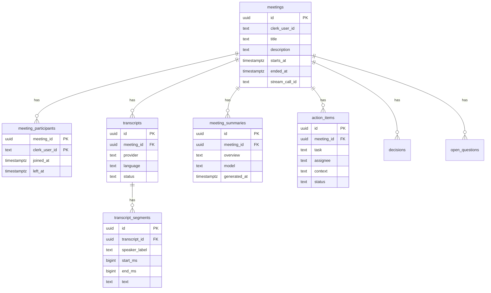

# YOOM — Complete Project & Research Reference Document

**Document type:** Technical and research source of truth for an academic paper  
**Codebase inspected:** `C:\Users\ingal\Desktop\Projects\YOOM`  
**Inspection date:** 2026-09-03  
**Git branch:** `main`  
**Commits observed:** `a383bbf` (Initial commit), `72af163` (Implemented some changes)  
**Package version:** `yoom@0.1.0` (private)

**Evidence classification used throughout this document:**

- **[VERIFIED]** — Confirmed in source code, schema, or configuration.
- **[DOCUMENTATION]** — Stated in README, plans, or review notes; not fully confirmed in running implementation.
- **[INFERRED]** — Reasonable inference from implementation, not explicitly stated.
- **[DATA REQUIRED]** — Cannot be determined from the repository.

This document must not be treated as containing experimental results. No user counts, accuracy scores, latency benchmarks, or evaluation datasets were found in the repository. **[DATA REQUIRED]**

---

# 1. Executive Summary

YOOM is a Next.js 14 TypeScript web application that combines Zoom-style real-time video conferencing with a planned local-first post-meeting intelligence pipeline. The conferencing layer is implemented and operational in code: Clerk authentication, GetStream video calls, meeting scheduling, recordings, and a personal room. **[VERIFIED]**

A second layer — meeting transcription, LLM summarization, speaker diarization, text-to-speech, structured action items, and multi-format export — exists as substantial application code (providers, server actions, Supabase schema, UI components). **[VERIFIED]** However, several of those intelligence features are only partially wired into the user-facing flow. The local FastAPI sidecar described in architecture docs is **not present** in the repository. Several UI components (`ExportMenu`, `AgentStatus`, `SummaryClient`) are implemented but not imported by any page. The post-meeting agent pipeline is never triggered from the meeting UI. **[VERIFIED]**

The original README still describes the project as “A Zoom Clone” from a JavaScript Mastery tutorial. **[DOCUMENTATION]** The actual codebase has been extended well beyond that tutorial into meeting intelligence, but the README has not been updated to match. **[VERIFIED]**

**Research relevance (honest):** YOOM is a useful engineering case study of (1) composing a third-party WebRTC platform with a structured meeting-intelligence data model, and (2) attempting a local-inference architecture for privacy-preserving transcription and summarization. A novel research contribution is **not yet established** from the codebase alone. Empirical evaluation, datasets, and baselines are missing. **[DATA REQUIRED]**

---

# 2. Project Overview

| Item | Value | Evidence |
|------|-------|----------|
| Name | YOOM | `package.json`, `app/layout.tsx` metadata **[VERIFIED]** |
| Stated product | Video calling app | `app/layout.tsx` description: “Video calling App” **[VERIFIED]** |
| Origin | Fork/adaptation of Adrian Hajdin / JS Mastery Zoom clone | `README.md` **[DOCUMENTATION]** |
| Current intent | Video conferencing + local AI meeting intelligence | `docs/architecture/ai-pipeline-plan.md`, `docs/tts-summary-redesign-plan.md`, `lib/ai`, `lib/transcription`, `supabase/migrations` **[VERIFIED]** |
| Runtime model | Next.js App Router web app; media on GetStream; metadata on Supabase; optional local sidecar + Ollama | code + docs **[VERIFIED / DOCUMENTATION]** |
| Version | 0.1.0, private | `package.json` **[VERIFIED]** |
| Production deployment | Not documented; no Dockerfile, no CI, no Vercel config committed | **[DATA REQUIRED]** |

YOOM’s implemented user-facing product is a dark-themed meeting dashboard: sign in, start/join/schedule calls, use a personal room, view previous calls and recordings, and (if a summary row exists) open a summary page. **[VERIFIED]**

---

# 3. Problem Statement

**Real-world problem (inferred from code + docs, not a formal problem statement in-repo):**

After a video meeting, participants typically lose spoken decisions, action items, and open questions unless someone takes notes. Cloud meeting-assistant products exist, but they send recordings to third-party AI services. YOOM attempts to keep conferencing in a standard web app while routing transcription and summarization to local models. **[INFERRED]**

**Who experiences the problem:** remote teams, students, and professionals who need meeting records without sending audio to a cloud AI vendor. **[INFERRED]**

**Why existing approaches may be insufficient:** cloud assistants raise privacy, cost, and data-retention issues; raw recordings are hard to review; manual notes are incomplete. **[INFERRED]**

**How this project attempts to solve it:**

1. Real-time meetings via GetStream (media never stored on YOOM servers). **[VERIFIED]**
2. Persist structured meeting intelligence in Supabase (overview, action items, decisions, open questions, transcript segments). **[VERIFIED]**
3. Transcribe via a local faster-whisper sidecar and summarize via local Ollama, with prompts that forbid fabrication. **[VERIFIED in adapters; sidecar itself missing]**

**Formal problem statement from the project team:** **[DATA REQUIRED]**

---

# 4. Motivation

Documented motivations:

- Tutorial/educational Zoom clone (README). **[DOCUMENTATION]**
- Local GPU inference for Whisper, diarization, embeddings, and LLM summarization on the user’s machine (`docs/architecture/ai-pipeline-plan.md`). **[DOCUMENTATION]**
- Privacy: sidecar bound to `127.0.0.1`; recordings fetched via GetStream signed URLs. **[DOCUMENTATION]**
- Post-meeting productivity: summaries, TTS playback, export (`docs/tts-summary-redesign-plan.md`). **[DOCUMENTATION]**

Creator motivation, supervisor requirements, and intended academic contribution are not stated in source. **[DATA REQUIRED]**

---

# 5. Objectives

Objectives that can be verified from code:

1. Provide authenticated real-time video meetings. **[VERIFIED]**
2. Support instant, scheduled, join-by-link, personal-room, previous, and recording flows. **[VERIFIED]**
3. Store meeting intelligence in a relational schema with RLS. **[VERIFIED]**
4. Provide pluggable transcription and summarization providers. **[VERIFIED]**
5. Display summaries and allow action-item status updates. **[VERIFIED]**
6. Provide TTS and export libraries. **[VERIFIED as libraries; UI wiring incomplete]**

Stated but not fully achieved:

- End-to-end local AI pipeline from “meeting ended” to stored summary. **[PARTIALLY IMPLEMENTED]**
- FastAPI sidecar packaged for end users. **[NOT IMPLEMENTED]**
- Parallel agent pipeline with live status UI. **[CODE EXISTS, NOT WIRED]**

---

# 6. Target Users

Not specified in product copy. **[INFERRED]** from features:

- Authenticated individuals who host or join video calls.
- Meeting participants who later need a written record.
- Developers evaluating local-first meeting AI.

User research, personas, and adoption data: **[DATA REQUIRED]**

---

# 7. Proposed Solution

YOOM is a hybrid system:

1. **Conferencing client** — Next.js UI + Stream Video React SDK. **[VERIFIED]**
2. **Identity** — Clerk session; Stream tokens minted from Clerk `currentUser()`. **[VERIFIED]**
3. **Meeting intelligence store** — Supabase Postgres, accessed with a Clerk JWT template named `supabase`. **[VERIFIED]**
4. **Local AI adapters** — HTTP clients in Next.js that expect:
   - `YOOM_SIDECAR_URL` (default `http://127.0.0.1:8765`) for transcription
   - `OLLAMA_HOST` (default `http://127.0.0.1:11434`) for summarization  
   **[VERIFIED]**
5. **Playback/export** — browser Web Speech API / optional OpenAI TTS; client-side PDF/Markdown/JSON/text export. **[VERIFIED]**

The architecture docs describe a FastAPI sidecar that downloads GetStream recordings, runs ffmpeg → Whisper → pyannote → sentence-transformers → LLM, and returns JSON. **[DOCUMENTATION]** No `sidecar/` directory, `pyproject.toml`, or Python inference server exists in the inspected tree. **[VERIFIED]**

---

# 8. Key Features

## 8.1 Implemented Features

### Authentication (Clerk)

- Sign-in: `app/(auth)/sign-in/[[...sign-in]]/page.tsx` renders `<SignIn />`. **[VERIFIED]**
- Sign-up: `app/(auth)/sign-up/[[...sign-up]]/page.tsx` renders `<SignUp />`. **[VERIFIED]**
- Root layout wraps app in `ClerkProvider` with dark theme variables. **[VERIFIED]**
- Middleware: `clerkMiddleware` + `createRouteMatcher`; non-public routes call `auth.protect()`. **[VERIFIED]**
- Public routes: `/`, `/sign-in(.*)`, `/sign-up(.*)`, `/api(.*)`, `/_next(.*)`, assets. **[VERIFIED]**

Note: `/api(.*)` is public, but **no `app/api` routes exist**. **[VERIFIED]**

### Instant meeting, join, schedule, recordings dashboard

- Home: `app/(root)/(home)/page.tsx` + `components/MeetingTypeList.tsx`. **[VERIFIED]**
- Create call: `client.call('default', crypto.randomUUID()).getOrCreate(...)`. **[VERIFIED]**
- Instant meeting navigates to `/meeting/{id}`. Scheduled meeting (with description) shows copy-link modal. **[VERIFIED]**
- Join meeting: user pastes a link; `router.push(values.link)`. **[VERIFIED]**
- Recordings card routes to `/recordings`. **[VERIFIED]**

### Live meeting room

- Route: `app/(root)/meeting/[id]/page.tsx`. **[VERIFIED]**
- Pre-join setup: `MeetingSetup.tsx` (preview, mic/cam toggle, device settings, scheduled-time gate, ended-call gate). **[VERIFIED]**
- In-call: `MeetingRoom.tsx` — grid / speaker-left / speaker-right, Stream `CallControls`, stats, participants list, host-only `EndCallButton`. **[VERIFIED]**
- Access check: if call type is `'invited'` and user is not a member, show Alert. **[VERIFIED]** Default Stream type used in create is `'default'`, so this check rarely applies. **[INFERRED]**

### Call history

- `hooks/useGetCalls.ts` queries Stream calls created by or including the user. **[VERIFIED]**
- Upcoming / previous / recordings pages render `CallList`. **[VERIFIED]**
- Recordings: `meeting.queryRecordings()` flattened into playable URLs. **[VERIFIED]**

### Personal room

- `app/(root)/(home)/personal-room/page.tsx` uses Clerk user id as call id; `?personal=true` hides End Call for everyone. **[VERIFIED]**

### Summary viewing (if data exists)

- Server page: `app/(root)/summary/[meetingId]/page.tsx` loads `getSummaryByMeetingId`. **[VERIFIED]**
- UI: `SummaryView.tsx` — overview, TTS, action-item toggle, decisions, open questions, optional searchable transcript, delete. **[VERIFIED]**
- Previous meetings: `CallList` queries `meeting_summaries.meeting_id` and may show “View Summary”. **[VERIFIED]** See ID-mismatch limitation in §19.

### Transcription / summarization libraries

- Provider interfaces, Whisper HTTP client, diarization merge, Ollama summarizer, save-to-Supabase functions. **[VERIFIED]**
- Server actions exist: `triggerTranscriptionAction`, `generateSummaryAction`, `startPostMeetingPipeline`. **[VERIFIED]**

### TTS library and player

- `lib/tts/*` + `components/TTSPlayer.tsx` used inside `SummaryView`. **[VERIFIED]**

### Export library

- `lib/download/*` + `hooks/useExport.ts` + `ExportMenu.tsx`. **[VERIFIED as code]** `ExportMenu` is **not imported** by `SummaryView` or any page. **[VERIFIED]**

## 8.2 Partially Implemented Features

| Feature | What exists | What is missing |
|---------|-------------|-----------------|
| Post-meeting pipeline | `lib/agents/pipeline.ts`, `dispatcher.ts`, `actions/agents.actions.ts`, `AgentStatus.tsx` | No UI calls `startPostMeetingPipeline`; `AgentStatus` unused; TTS task is a log stub; agents run **in parallel** so summary can run before transcript exists |
| Persist meetings to Supabase | `lib/supabase/meetings.ts` `createMeeting()` | Never called from `MeetingTypeList` / personal room; Stream is the system of record for calls |
| In-meeting transcript panel | `MeetingRoom.tsx` polls `getTranscriptAction(call.id)` | Requires transcript keyed by Stream call id; schema uses UUID `meetings.id`; live STT is not implemented |
| Summary transcript section | `SummaryView` accepts `transcript?` | `summary/[meetingId]/page.tsx` does not pass transcript |
| OpenAI TTS | Client implementation + voice menu | Requires `NEXT_PUBLIC_OPENAI_API_KEY` (browser-exposed); not in `.env.example` |
| Pagination of summaries | `getAllSummariesForUser(page, limit)` | Queries `meetings.user_id` but column is `clerk_user_id`; no UI list page uses it |
| UI redesign | tokens, glassmorphism-v2, some hover/animation classes | `framer-motion` is a dependency but unused; home “Upcoming Meeting at: 12:30 PM” is hardcoded |

## 8.3 Planned / Unused / Documentation-Only

| Item | Status |
|------|--------|
| FastAPI sidecar (`sidecar/main.py`, Whisper, pyannote, embeddings) | Documented only; directory absent **[VERIFIED]** |
| Embeddings / vector search / sentence-transformers | Architecture plan only **[DOCUMENTATION]** |
| Prisma + MySQL | Dependencies in `package.json`; no `prisma/` schema, no usage **[VERIFIED]** |
| `SummaryClient.tsx` | Implemented, never imported **[VERIFIED]** |
| `ExportMenu` / JSON-MD-PDF from summary page | Component exists; not mounted **[VERIFIED]** |
| `actions/tts.actions.ts`, `actions/download.actions.ts` | Planned in redesign doc; files not present **[VERIFIED]** |
| Search bar, notification bell, stats row, summaries carousel | Planned in redesign doc; not in `Navbar` / home page **[VERIFIED]** |
| Playwright E2E tests | `.playwright-mcp/` logs exist (untracked); no test script in `package.json` **[VERIFIED]** |
| Production packaging of sidecar (PyInstaller, Tauri, Electron) | Plan only **[DOCUMENTATION]** |

---

# 9. Complete User Workflow

Only workflows that exist in code are listed.

### 9.1 Registration / Login  **[VERIFIED]**

1. User opens `/sign-in` or `/sign-up`.
2. Clerk hosted components handle identity.
3. `middleware.ts` protects non-public routes with `auth.protect()`.
4. `StreamVideoProvider` redirects unsigned users to `/sign-in`.
5. After sign-in, `(root)/layout.tsx` mounts Stream client using Clerk user id/name/image and `tokenProvider`.

### 9.2 Instant meeting  **[VERIFIED]**

1. Home → “New Meeting” → modal → `createMeeting()`.
2. Stream `getOrCreate` with `starts_at` now and description “Instant Meeting”.
3. Navigate to `/meeting/{uuid}`.
4. `useGetCallById` → `MeetingSetup` → `call.join()` → `MeetingRoom`.
5. Leave via Stream controls (`router.push('/')`) or host “End call for everyone”.

### 9.3 Schedule meeting  **[VERIFIED]**

1. Description + `ReactDatePicker`.
2. `getOrCreate` with future `starts_at`.
3. Copy link `${NEXT_PUBLIC_BASE_URL}/meeting/{id}`.
4. If user opens early, `MeetingSetup` shows “has not started yet”.

### 9.4 Join by link  **[VERIFIED]**

User pastes URL or path; client navigates there. No extra invite ACL on `'default'` calls.

### 9.5 Personal room  **[VERIFIED]**

Stable id = Clerk user id; copy invitation; start meeting with `?personal=true`.

### 9.6 Recordings  **[VERIFIED]**

`/recordings` → `CallList type="recordings"` → `queryRecordings()` → play via recording URL.

### 9.7 View previous + summary  **[VERIFIED / PARTIAL]**

`/previous` lists ended Stream calls. If `meeting_summaries` contains a row whose `meeting_id` equals the Stream call id, “View Summary” appears. Summary page is a server render of Supabase data. Action items can be toggled via `updateActionItemStatus`. Delete redirects home.

### 9.8 AI processing  **[PARTIALLY IMPLEMENTED]**

Intended path (docs + actions): recording URL → `processMeetingTranscription` → sidecar → save transcript → `generateMeetingSummary` → Ollama → save summary.

**Actual gap:** no button on recordings or meeting-end UI invokes `triggerTranscriptionAction`, `generateSummaryAction`, or `startPostMeetingPipeline`. `createMeeting` (Supabase) is never called, so intelligence tables have no guaranteed meeting row. **[VERIFIED]**

---

# 10. Technology Stack

| Technology | Where used | Why it appears to be used | Status |
|------------|------------|---------------------------|--------|
| TypeScript | Entire app | Type-safe UI and adapters | **[VERIFIED]** |
| Next.js 14 App Router | `app/`, server actions | Pages, layouts, RSC, `'use server'` | **[VERIFIED]** |
| React 18 | Components | UI | **[VERIFIED]** |
| Tailwind CSS + `tailwindcss-animate` | `globals.css`, `tailwind.config.ts` | Dark Zoom-like theme | **[VERIFIED]** |
| shadcn/ui + Radix | `components/ui/*`, `components.json` | Dialog, dropdown, toast, sheet, progress | **[VERIFIED]** |
| Clerk `@clerk/nextjs` ^6.13 | layout, middleware, auth pages, `currentUser()` | AuthN | **[VERIFIED]** |
| Stream Video React SDK + Node SDK | provider, meeting UI, `tokenProvider` | WebRTC calls, recordings | **[VERIFIED]** |
| Supabase JS + SSR | `lib/supabase/*` | Postgres access with Clerk JWT | **[VERIFIED]** |
| date-fns | Summary cards/views | Date formatting | **[VERIFIED]** |
| react-datepicker | Schedule modal | Date/time input | **[VERIFIED]** |
| lucide-react | Icons in newer UI | Icons | **[VERIFIED]** |
| @react-pdf/renderer | `lib/download/pdf.tsx` | Client PDF | **[VERIFIED]** |
| uuid | dependency | Not observed as imported in inspected TS; Stream ids use `crypto.randomUUID()` | **[INFERRED unused]** |
| Ollama HTTP API | `lib/ai/ollama-local.ts` | Local LLM summarization | **[VERIFIED client]** |
| faster-whisper (intended) | sidecar docs + `WhisperLocalProvider` | Local STT | **[DOCUMENTATION / adapter only]** |
| pyannote (intended) | architecture plan | Diarization | **[DOCUMENTATION]** |
| Web Speech API | `lib/tts/web-speech.ts` | Browser TTS | **[VERIFIED]** |
| OpenAI Audio Speech API | `lib/tts/openai-tts.ts` | Neural TTS fallback | **[VERIFIED code]** |
| Prisma + mysql2 | `package.json` only | Likely leftover / abandoned DB plan | **[VERIFIED unused]** |
| framer-motion | `package.json` only | Planned animations | **[VERIFIED unused]** |
| ESLint + Prettier | `.eslintrc.json` | Lint; `npm run lint` reports Tailwind warnings only | **[VERIFIED]** |
| `tsc --noEmit` | tsconfig strict | Compiles with no errors at inspection | **[VERIFIED]** |

**Not present:** REST API framework, Redis, vector DB, LangChain, training code, Docker, GitHub Actions, Jest/Vitest/Playwright scripts, Python sidecar.

---

# 11. System Architecture

**Client:** Next.js React UI, Clerk session, Stream Video client in browser. Media (audio/video) is handled by GetStream’s network, not YOOM servers. **[VERIFIED]**

**BFF / backend:** Next.js server actions under `actions/`. No `app/api` route handlers. **[VERIFIED]**

**Auth:** Clerk cookies + `auth.protect()`; Stream JWTs (1 hour, issued 60s in the past). **[VERIFIED]**

**Database:** Supabase Postgres + RLS. Server client injects Clerk JWT (`template: 'supabase'`) as `Authorization: Bearer`. Browser client uses anon/publishable key without the custom fetch wrapper. **[VERIFIED]**

**AI:** Optional local processes (sidecar, Ollama) invoked over loopback HTTP. **[VERIFIED adapters; processes not in repo]**

**Background jobs:** None (no queue). Pipeline status is an in-memory `Map` in the server-action module. **[VERIFIED]** This will not survive process restart or scale across serverless instances.

**Storage:** No app-managed object storage. Recordings live on Stream (signed URLs, documented 14-day TTL). **[DOCUMENTATION]**

---

# 12. Architecture Diagram

The sidecar node is **documented and client-called**, but the sidecar application is **not in this repository**. **[VERIFIED]**

---

# 13. Component Breakdown

| Component | File | Purpose |
|-----------|------|---------|
| Root layout | `app/layout.tsx` | ClerkProvider, Inter font, Toaster, Stream CSS |
| Auth pages | `app/(auth)/sign-in/...`, `sign-up/...` | Clerk widgets |
| Stream wrapper | `providers/StreamClientProvider.tsx` | StreamVideoClient + tokenProvider |
| Home dashboard | `app/(root)/(home)/page.tsx` | Hero + MeetingTypeList |
| Nav | `Navbar.tsx`, `Sidebar.tsx`, `MobileNav.tsx` | Chrome |
| Meeting orchestration | `app/(root)/meeting/[id]/page.tsx` | Setup vs room |
| Meeting UI | `MeetingSetup.tsx`, `MeetingRoom.tsx`, `EndCallButton.tsx` | Call UX |
| Lists | `CallList.tsx`, `MeetingCard.tsx` | Upcoming/previous/recordings |
| Summary page | `app/(root)/summary/[meetingId]/page.tsx` | RSC fetch |
| Summary UI | `SummaryView.tsx`, `TTSPlayer.tsx` | Intelligence display |
| Unused UI | `ExportMenu.tsx`, `AgentStatus.tsx`, `SummaryCard.tsx`, `SummaryClient.tsx` | Built, not routed |
| Stream token | `actions/stream.actions.ts` | Server JWT |
| AI actions | `actions/ai.actions.ts`, `transcription.actions.ts`, `agents.actions.ts`, `summary.actions.ts` | Intelligence |
| Hooks | `hooks/useGetCalls.ts`, `useGetCallById.ts`, `useExport.ts` | Data/export |
| Utils | `lib/utils.ts` | `cn()` |

---

# 14. Frontend Architecture

- **Routing groups:** `(auth)` unauthenticated Clerk pages; `(root)` Stream-wrapped app; `(home)` navbar/sidebar shell for dashboard pages. Meeting and summary routes sit under `(root)` but **not** under `(home)`, so they lack the dashboard chrome. **[VERIFIED]**
- **Client vs server:** Meeting/call UI is client-side (Stream hooks). Summary page is a server component calling Supabase. `SummaryView` is client (toggles, TTS, delete).
- **State:** React local state; no Redux/Zustand. Stream SDK holds call state. Pipeline status lives in a server `Map`.
- **Styling:** Custom palette `dark-*`, `blue-1`, `purple-1`, `yellow-1`, `accent-*`, `text-*`; glassmorphism utilities; Stream CSS overrides in `globals.css`.
- **Hardcoded UI:** Home hero “Upcoming Meeting at: 12:30 PM” is not data-driven. **[VERIFIED]**
- **Decorative avatars:** `MeetingCard` always shows five stock avatars plus “+5”, not actual participants. **[VERIFIED]**

---

# 15. Backend Architecture

Backend = Next.js server actions + Supabase + Stream Node SDK.

| Action | File | Auth | Behavior |
|--------|------|------|----------|
| `tokenProvider` | `actions/stream.actions.ts` | `currentUser()` | Stream JWT, 3600s exp |
| `triggerTranscriptionAction` | `actions/transcription.actions.ts` | Clerk | `getMeeting` then `processMeetingTranscription` |
| `generateSummaryAction` | `actions/ai.actions.ts` | Clerk | load transcript, `generateMeetingSummary` |
| `startPostMeetingPipeline` / `getAgentStatus` | `actions/agents.actions.ts` | Clerk (start only) | in-memory pipeline |
| `updateActionItemStatus` / `deleteSummary` / getters | `actions/summary.actions.ts` | Clerk | Supabase CRUD |

`getAgentStatus` does **not** re-check Clerk auth; it only reads the in-memory map. **[VERIFIED]**

There is no job queue, webhook receiver, or Stream event handler for “call ended” / “recording ready”. **[VERIFIED]**

---

# 16. Database Architecture

Single migration: `supabase/migrations/20260819_create_schema.sql`.

**Engine:** PostgreSQL (Supabase) with `uuid-ossp`. **[VERIFIED]**

**Tables:**

1. `meetings` — id UUID PK, `clerk_user_id`, title, description, `starts_at`, `ended_at`, `stream_call_id`, timestamps.
2. `meeting_participants` — composite PK `(meeting_id, clerk_user_id)`, `joined_at`, `left_at`.
3. `transcripts` — meeting FK, provider, language, status check (`pending|processing|ready|failed`).
4. `transcript_segments` — transcript FK, speaker_label, start_ms, end_ms, text.
5. `meeting_summaries` — meeting FK, overview, model, generated_at. **No UNIQUE on `meeting_id` in SQL**, but `saveSummary` uses `upsert(..., { onConflict: 'meeting_id' })`. **[VERIFIED mismatch]**
6. `action_items` — meeting FK, task, assignee, context, status `open|done`.
7. `decisions` — meeting FK, decision, context.
8. `open_questions` — meeting FK, question, context.

**Indexes:** clerk_user_id, starts_at DESC, participant user, and meeting_id on child tables. **[VERIFIED]**

**RLS:** enabled on all eight tables. Helper `current_clerk_user_id()` reads JWT `sub`. **[VERIFIED]**

**Important RLS behaviors:**

- Meetings: creator CRUD; SELECT also for participants with `left_at IS NULL`.
- Transcripts/summaries/decisions/questions SELECT: **participants only**, not meeting creator unless also a participant row. Creator-only meetings with zero participant rows would fail SELECT. **[VERIFIED]**
- INSERT policies on transcripts/summaries/action_items/decisions/open_questions: `WITH CHECK (true)` (“System can insert”). Combined with a user JWT this is broad; combined with service role it is expected. **[VERIFIED]**
- Action item UPDATE: assignee must equal `current_clerk_user_id()`. LLM assignees are **names**, not Clerk ids, so UI toggles via server action may fail RLS unless using a key that bypasses RLS. **[INFERRED]**
- No DELETE policy on `meeting_summaries` except what default deny implies; `deleteSummary` may fail under RLS. **[INFERRED]**

Prisma/MySQL is unused. **[VERIFIED]**

---

# 17. API Architecture

**No first-party HTTP API routes** under `app/api`. **[VERIFIED]**

External HTTP used by the app:

| Target | Method | Caller | Purpose |
|--------|--------|--------|---------|
| Stream Video | SDK | client + `StreamClient.createToken` | Calls, recordings |
| Supabase REST | SDK | server/browser | CRUD |
| `{YOOM_SIDECAR_URL}/infer/transcribe` | POST | `WhisperLocalProvider` | Start/return transcription |
| `{YOOM_SIDECAR_URL}/infer/status/{jobId}` | GET | poll up to 300s | Job result |
| `{OLLAMA_HOST}/api/generate` | POST | `OllamaLocalProvider` | JSON summary |
| `https://api.openai.com/v1/audio/speech` | POST | `OpenAITTSProvider` in browser | TTS audio |

Clerk and Stream also use their own cloud APIs via SDKs.

---

# 18. Authentication & Authorization

**Authentication:** Clerk. **[VERIFIED]**

**Authorization layers:**

1. Next middleware `auth.protect()` on non-public pages. **[VERIFIED]**
2. Server actions throw if `!currentUser()`. **[VERIFIED]**
3. Stream tokens bound to Clerk user id. **[VERIFIED]**
4. Meeting page member check only for type `'invited'`. **[VERIFIED]**
5. Supabase RLS using Clerk `sub`. **[VERIFIED]**

**Gaps:**

- `/` is public; dashboard home is `/` inside `(home)` — wait: `isPublicRoute` includes `'/'`. So the **home dashboard is a public route** and is **not** protected by `auth.protect()`. Protection for `/` relies on `StreamVideoProvider` client redirect. **[VERIFIED]** That is weaker than middleware protection (flash of content, RSC still runs).
- `/summary/[meetingId]` is not in the public list, so it **is** middleware-protected. **[VERIFIED]**
- `/meeting/[id]` is protected by middleware. **[VERIFIED]**
- OpenAI key as `NEXT_PUBLIC_*` is visible to all clients. **[VERIFIED]**
- `.env.example` in the repo contains live-looking Clerk and Stream key values (not reproduced here). **[VERIFIED]** Those should be treated as compromised if they were ever real.

---

# 19. AI/ML Architecture

AI **is** present as inference **clients** and prompts. There is **no training, fine-tuning, evaluation harness, or vector database** in the repo. **[VERIFIED]**

### Transcription

- Interface: `lib/transcription/provider.ts`.
- Implementation: `WhisperLocalProvider` (`name = 'faster-whisper-local'`).
- Input: recording URL + meetingId.
- Protocol: POST JSON `{ url, meeting_id, language, chunk_duration_seconds }`; if `job_id` returned, poll `/infer/status/{id}` every 2s for up to 300s.
- Retry: 3 attempts, exponential backoff `2^attempt * 500` ms.
- Post-process: map seconds → ms; `mergeDiarization()` if sidecar returns diarization.
- Persist: `saveTranscript` inserts transcript + segments; on failure inserts `status: 'failed'`.
- Timeouts at pipeline layer: 120s (may be shorter than sidecar poll 300s). **[VERIFIED]**

### Diarization

- `mergeDiarization` assigns speaker from overlapping diarization interval if transcript segment lacks `speaker_label`; otherwise null. **[VERIFIED]**
- pyannote itself is not in this repo. **[VERIFIED]**

### Summarization

- Interface: `AIProvider.summarize` → `MeetingSummaryResult` with overview, provenance (`explicit|inferred|mixed`), action_items, decisions, open_questions, model. **[VERIFIED]**
- Implementation: `OllamaLocalProvider`, default model `llama3.2`.
- Empty/short transcripts (<15 words): heuristic stub, no LLM call. **[VERIFIED]**
- Long text: character chunks (default 12000) then reduce prompt. **[VERIFIED]**
- `format: 'json'` on Ollama generate; parse object from response; validate/normalize; one retry on invalid JSON. **[VERIFIED]**
- Prompts in `lib/ai/prompts.ts` instruct: no fabrication, assignees only if named, provenance tagging, JSON only. **[VERIFIED]**
- Persist: `saveSummary` upsert summary + insert children (does not clear old action items on re-run). **[VERIFIED]**

### Agent pipeline

`dispatchAgents` runs **all tasks concurrently** via `Promise.allSettled` + per-task `Promise.race` timeout. **[VERIFIED]**

Tasks: transcription (needs recordingUrl), summary (reads transcript), TTS (logs “TTS caching pending”). Because they are parallel, summarization often sees no transcript. **[VERIFIED design flaw]**

Status fields include `'pending' | 'running'` but dispatcher only returns `success | error | timeout`. UI “running” is therefore largely unused. **[VERIFIED]**

### TTS

- Default: Web Speech, sentence-chunked at 32k chars.
- Optional OpenAI `gpt-4o-mini-tts`, voice default `nova`, in-memory blob cache (max 50).
- Pipeline TTS does not call these providers. **[VERIFIED]**

### Embeddings / RAG

Architecture plan mentions `all-MiniLM-L6-v2`. **Not implemented.** **[VERIFIED]**

---

# 20. Data Flow

### Stream token

`StreamVideoProvider` → `tokenProvider` → Clerk `currentUser` → `StreamClient.createToken(user.id)` → browser SDK. **[VERIFIED]**

### Create meeting (actual)

`MeetingTypeList.createMeeting` → Stream `getOrCreate` only. **Does not write Supabase `meetings`.** **[VERIFIED]**

### Intended transcription (code path, unwired)

`triggerTranscriptionAction(meetingId, recordingUrl)` → `getMeeting(meetingId)` → sidecar → `saveTranscript`. **[VERIFIED]**

### Intended summary (code path, unwired)

`generateSummaryAction` → `getTranscript` → Ollama → `saveSummary`. **[VERIFIED]**

### Summary page

RSC `getSummaryByMeetingId` → parallel fetch meeting + action_items + decisions + open_questions → `SummaryView`. Transcript not loaded. **[VERIFIED]**

### Action item toggle

Optimistic UI → `updateActionItemStatus` server action → `action_items.update`. Reverts on throw. **[VERIFIED]**

### In-meeting transcript poll

Every 5s while panel open: `getTranscriptAction(call.id)` with Stream call id as `meeting_id`. **[VERIFIED]**

---

# 21. Database Schema

**ID alignment problem [VERIFIED]:** Stream call ids are UUIDs from `crypto.randomUUID()` (or Clerk user id for personal rooms). Supabase `meetings.id` is a **different** generated UUID; Stream id is supposed to live in `stream_call_id`. UI paths use Stream id as `meetingId` (`/summary/${call.id}`, `getTranscriptAction(call.id)`). Unless someone inserts `meetings.id = stream call id` (schema default is `uuid_generate_v4()`, so they will not match), summary lookup and CallList `.in('meeting_id', streamIds)` will miss rows.

---

# 22. API Documentation

### Server actions (application “API”)

All require a signed-in Clerk user unless noted.

**`tokenProvider()`** — `actions/stream.actions.ts`  
No params. Returns Stream JWT string. Throws if unauthenticated or missing Stream env.

**`triggerTranscriptionAction(meetingId, recordingUrl)`**  
Looks up Supabase meeting by UUID; runs Whisper provider; returns `TranscriptionResult`. Throws if meeting missing.

**`generateSummaryAction(meetingId)`**  
Requires transcript with segments; returns `MeetingSummaryResult`.

**`startPostMeetingPipeline(meetingId, recordingUrl?)`**  
Returns cached status if `completedAt` set; else runs parallel agents; stores in process memory.

**`getAgentStatus(meetingId)`**  
Returns `PipelineStatus | null`. **No auth check.**

**`updateActionItemStatus(id, 'open'|'done')`**  
**`deleteSummary(summaryId)`**  
**`getTranscriptAction` / `getSummaryAction` / `getMeetingAction`** — return null on PostgREST `PGRST116`.

### Sidecar (specified, not implemented in-repo)

**POST `/infer/transcribe`** body `{ url, meeting_id, language?, chunk_duration_seconds? }`  
**GET `/infer/status/{job_id}`** statuses queued|downloading|transcribing|...|completed|failed **[DOCUMENTATION]**

### Ollama

**POST `/api/generate`** `{ model, prompt, stream: false, format: 'json' }` → `{ response }`. **[VERIFIED]**

---

# 23. Security

**Implemented [VERIFIED]:**

- Clerk auth on most routes and server actions.
- Stream tokens short-lived and user-scoped.
- Supabase RLS + Clerk JWT `sub`.
- Parameterized Supabase queries (not raw SQL strings).
- `.gitignore` includes `.env`.
- Stream provider surfaces missing API key instead of throwing inside effect (improved vs older PROJECT_STATUS.md).

**Weaknesses [VERIFIED / INFERRED]:**

1. Home `/` excluded from `auth.protect()`.
2. `NEXT_PUBLIC_OPENAI_API_KEY` in browser; anyone can extract and bill the key.
3. `.env.example` contains credential-shaped Clerk/Stream values.
4. Sidecar has no auth in the plan (“local-only”).
5. Broad `WITH CHECK (true)` insert policies.
6. Transcripts SELECT requires participant row; creators may be locked out.
7. `getAgentStatus` unauthenticated relative to Clerk (still a server action callable by a session; map is not user-scoped).
8. No rate limiting in app code.
9. `confirm()` delete; no CSRF beyond Next/Clerk cookies.
10. Recording URLs are signed and shareable (Stream design); 14-day public fetch **[DOCUMENTATION]**.
11. XSS: React default escaping; transcript text rendered as text nodes (good). `dangerouslySetInnerHTML` not observed in inspected files.
12. File upload: none in app.
13. Strix security scan artifacts under `strix_runs/` — findings not treated as verified vulnerabilities here. **[DATA REQUIRED to interpret SARIF]**

**Secrets:** This document does not reproduce any key values.

---

# 24. Testing

| Artifact | What it is |
|----------|------------|
| `lib/ai/__tests__/ai-summarization.test.ts` | Manual script using `console.assert` on empty/short transcript heuristics; **does not call a test runner**; **does not mock Ollama** for those branches (those branches skip HTTP) |
| `package.json` scripts | `dev`, `dev:turbo`, `build`, `start`, `lint` — **no `test`** |
| CI | No `.github/workflows` observed |
| Playwright | Untracked `.playwright-mcp` logs suggest exploratory browser sessions, not a test suite |
| Coverage | None |

`npm run lint` at inspection: **warnings only** (Tailwind class order). `npx tsc --noEmit`: **success**. **[VERIFIED]**

The review file `docs/review/ai-pipeline-review.md` claims PASS, sidecar isolation, and production readiness. That review **overstates** the repo: sidecar is absent, several UI integrations are missing, and “production deployment” is not evidenced. **[VERIFIED contradiction]**

---

# 25. Performance

Observed mechanisms (no measurements):

- Stream handles media off-app.
- Ollama/sidecar work is async HTTP.
- Summary child fetches use `Promise.all`.
- `getAllSummariesForUser` paginates with `.range` but N+1 fetches per summary.
- OpenAI TTS caches blobs in a `Map`.
- Whisper client retries and job polling.
- Next image remote pattern for `img.clerk.com`.

**No latency, WER, throughput, or memory figures exist in code.** Success criteria in the redesign plan (“summary < 30s, TTS start < 2s, PDF < 5s”) are **goals, not measurements**. **[PERFORMANCE DATA REQUIRED]**

---

# 26. Deployment

- Next scripts: `next build` / `next start`. **[VERIFIED]**
- `next.config.mjs`: Clerk image host only. **[VERIFIED]**
- No Dockerfile, docker-compose, Vercel project file, Kubernetes, or sidecar installer. **[VERIFIED]**
- Local AI requires user-installed Ollama + (planned) Python sidecar, GPU recommended in docs. **[DOCUMENTATION]**
- Env vars required for a working conferencing app: Clerk keys, Stream keys, `NEXT_PUBLIC_BASE_URL`. Intelligence additionally needs Supabase URL + anon key, Clerk JWT template `supabase`, sidecar, Ollama. Server client reads `NEXT_PUBLIC_SUPABASE_ANON_KEY` but `.env.example` names `NEXT_PUBLIC_SUPABASE_PUBLISHABLE_KEY`. **[VERIFIED mismatch]**

Production URL, hosting provider, and environment: **[DATA REQUIRED]**

---

# 27. Research Motivation

YOOM is worth studying as an **engineering integration** of:

1. Third-party real-time communications (GetStream).
2. Identity federation into a database (Clerk JWT → Supabase RLS).
3. Structured meeting-mining (action items, decisions, questions) with anti-hallucination prompting.
4. An intended **local-inference** deployment model for speech and LLM workloads.

The privacy-preserving local pipeline is the most research-relevant idea, but it is only partially realized. **[VERIFIED / INFERRED]**

Relevance: meeting assistants are commercially important; privacy of meeting audio is a genuine concern; on-device/local ASR+LLM is an active systems topic. **[INFERRED]**

Experimental angles: ASR quality, summarization faithfulness, end-to-end latency, energy, and whether the hybrid Stream+local-AI architecture is usable. **[INFERRED]** None of these experiments are in the repo. **[DATA REQUIRED]**

---

# 28. Research Objectives

Proposed (not claimed as completed):

1. Document the hybrid RTC + local AI architecture as implemented.
2. Identify integration failure modes (id mismatch, parallel pipeline, unwired triggers).
3. If evaluation is added: compare local Whisper/Ollama vs cloud ASR/LLM on meeting audio. **[DATA REQUIRED]**
4. Assess privacy properties (what data leaves the machine). **[INFERRED]**

---

# 29. Research Questions

1. Can a tutorial-grade Zoom clone be extended into a meeting-intelligence system without hosting media? (Engineering; largely yes for RTC, incomplete for AI.)
2. Does local Whisper+Ollama produce faithful action items under the project’s provenance-constrained prompts?
3. What is the latency and resource cost of the sidecar pipeline vs cloud APIs?
4. Do RLS policies based on meeting participation correctly encode conferencing authorization?
5. How should Stream call ids be bound to application UUIDs?

Questions 2–3 require new experiments. **[DATA REQUIRED]**

---

# 30. Existing Systems

**Do not treat the following as a competitive study with measured superiority.** No comparison data is in the repo.

**Commercial conferencing:** Zoom, Google Meet, Microsoft Teams — recording, some AI companions. YOOM uses GetStream instead of owning media SFU. **[INFERRED]**

**Commercial meeting assistants:** Otter.ai, Fireflies.ai, Fathom, Grain — cloud transcription/summaries. YOOM’s *stated* difference is local inference. **[DOCUMENTATION]** Difference is **architectural intent**, not evaluated quality.

**Open-source / academic:** Whisper (ASR), pyannote (diarization), Ollama-hosted LLMs, other Zoom-clone tutorials. YOOM composes these rather than introducing a new model. **[VERIFIED]**

**Base artifact:** JS Mastery Zoom clone (Clerk + Stream + Next). **[DOCUMENTATION]**

---

# 31. Literature Review Direction

Suggested search topics for the paper writer (not citations — none are copied from the repo because the repo contains no bibliography):

- End-to-end ASR (Whisper and faster-whisper)
- Neural speaker diarization (pyannote)
- Meeting summarization and action-item extraction
- Hallucination / faithfulness in LLM summarization
- Local-first software and on-device inference
- WebRTC platforms and recording pipelines
- Usable privacy for workplace communications

Use IEEE/ACM/ACL venues. Do not invent citations. **[DATA REQUIRED for actual related-work list]**

---

# 32. Research Gap

**Existing research → limitation → YOOM approach → gap**

| Existing | Limitation | YOOM approach | Gap status |
|----------|------------|---------------|------------|
| Cloud meeting AI | Audio leaves tenant | Local sidecar + Ollama | Approach is designed, sidecar missing; no eval |
| Raw recordings | Poor reviewability | Structured summary schema | Schema/UI exist; generation not auto-triggered |
| LLM summaries | Fabricated todos | Strict JSON schema + provenance field | Prompting implemented; no human faithfulness study |
| Zoom clones | No intelligence layer | Combined RTC + intelligence data model | Integration bugs (IDs, wiring) remain |

A publishable research gap is **not yet empirically demonstrated**. The honest contribution today is a **system description and implementation analysis**, possibly a case study of incomplete local-AI integration. Claiming novelty without experiments would be unjustified.

---

# 33. Research Contributions

**Engineering contributions [VERIFIED]:**

- Working Clerk + Stream meeting product on Next.js 14.
- Normalized meeting-intelligence schema with RLS sketches.
- Provider abstractions for STT, LLM, TTS, export.
- Constrained summarization prompt and JSON validation/retry.
- Partial dashboard/summary UI.

**Research contributions:** **Not established.** No new algorithm, dataset, or measured improvement. Local-first meeting AI is a **potential** systems contribution if completed and evaluated.

Do not call the system “novel” in a paper without qualifying it as an integration architecture.

---

# 34. Proposed Research Methodology

Appropriate genre: **design and implementation of a software system**, optionally with a **controlled experiment** and/or **user study**.

Suggested flow:

1. Problem identification (privacy vs meeting capture).
2. Literature review (ASR, diarization, meeting summarization, local-first).
3. System design (hybrid architecture).
4. Implementation (this codebase + missing sidecar).
5. Experimental setup (datasets, hardware, baselines).
6. Evaluation (WER, summary faithfulness, latency, energy, SUS).
7. Results / discussion / limitations.

Until experiments exist, the paper must remain a system/experience paper and mark results as future work.

---

# 35. Experimental Setup

**Not present in repo.** A defensible setup would be:

- Hardware: specify CPU/GPU/RAM used for sidecar and Ollama. **[DATA REQUIRED]**
- Models: faster-whisper size (plan says `large-v3`); Ollama `llama3.2` default. **[DOCUMENTATION / VERIFIED default]**
- Data: meeting recordings with consent; or public meeting corpora. **None bundled.** **[DATA REQUIRED]**
- Baselines: cloud Whisper API, a hosted meeting assistant, extractive baseline.
- Protocol: same audio → local pipeline vs cloud; blind human rating of action items.

---

# 36. Evaluation Metrics

Only metrics that fit this system:

| Metric | Why appropriate | Data in repo |
|--------|-----------------|--------------|
| WER / CER | Transcription quality | No |
| Action-item precision/recall vs human notes | Core product claim | No |
| Decision/question extraction F1 | Structured outputs | No |
| Faithfulness / hallucination rate | Prompt explicitly forbids invention | No |
| JSON schema validity rate | Validator/retry exists | No |
| End-to-end latency | Pipeline timeouts 30–120s | No |
| CPU/GPU/memory | Local-inference claim | No |
| Task completion / SUS | UX of summary+TTS | No |

Do **not** use MAE/RMSE/ranking metrics unless a regression/ranking task is added.

Redesign plan mentions WCAG 2.1 AA; no a11y audit artifacts. **[DOCUMENTATION]**

---

# 37. Expected Results

**These are hypotheses, not findings.**

- Local inference should keep raw audio off YOOM servers (media already on Stream; AI step can stay local if sidecar is used). **[INFERRED]**
- Quality will depend on Whisper model size and LLM; empty-transcript heuristics already avoid hallucinating todos on silence. **[VERIFIED behavior]**
- Parallel agent dispatch will under-perform sequential STT→LLM unless fixed. **[VERIFIED]**
- Without fixing meeting id mapping, users will often see “Summary not found”. **[INFERRED]**

---

# 38. Limitations

### Observed (in code)

1. README still describes a Zoom clone; intelligence features undocumented there.
2. No sidecar implementation.
3. Meetings not inserted into Supabase on create.
4. Stream id vs Supabase UUID mismatch in UI queries.
5. Pipeline parallelization vs data dependencies.
6. TTS pipeline stub; ExportMenu/AgentStatus unused.
7. In-memory pipeline status.
8. `getAllSummariesForUser` wrong column `user_id`.
9. Upsert onConflict `meeting_id` without unique constraint in migration.
10. Prisma/mysql2/framer-motion unused dependencies.
11. Almost no tests, no CI, no Docker.
12. Hardcoded upcoming-meeting time; fake attendee avatars.
13. Summary page omits transcript and export.
14. Env example vs code key name mismatch (`ANON` vs `PUBLISHABLE`).
15. Public `/` route.
16. Browser-exposed OpenAI key pattern.
17. Review document claims production readiness without evidence.

### Potential

- Scalability of local GPU requirement.
- Stream recording retention (14 days) vs user expectation.
- Legal/consent for recording and local model processing.
- Hallucinations remaining despite prompts.
- Serverless hosting incompatibility with loopback sidecar.

---

# 39. Future Scope

### Short-term

- Implement or vendor the sidecar.
- Call `createMeeting` with `stream_call_id` on Stream `getOrCreate`.
- Query summaries by `stream_call_id`.
- Sequential pipeline: transcribe → summarize → TTS.
- Wire ExportMenu and AgentStatus.
- Pass transcript into SummaryView.
- Trigger pipeline on recording available / call end.
- Fix RLS for creators and action-item updates.
- Add unique(`meeting_id`) on summaries; replace children on regenerate.
- Remove secrets from `.env.example`; align env names.
- Protect `/` in middleware.
- Add automated tests.

### Advanced features (from plans, not implemented)

- Embeddings/search, live captions, Tauri/Electron sidecar, notifications, meeting search.

### Research opportunities

- Faithfulness evaluation of provenance-tagged summaries.
- Privacy measurement (what bytes leave the host).
- Human factors of TTS meeting recap.

### Scalability

- Job queue instead of in-memory Map.
- Do not assume sidecar on Vercel; split “cloud app” vs “local worker”.

### AI/ML

- Real sequential pipeline; model selection UI; evaluation set; do not ship `NEXT_PUBLIC` LLM keys.

---

# 40. Conclusion

YOOM is a **functional video conferencing web app** built on Next.js, Clerk, and GetStream, extended with a **substantial but incomplete meeting-intelligence layer** (Supabase schema, Whisper/Ollama adapters, summary UI, TTS, export libraries). **[VERIFIED]**

It is **not** a finished local-AI product: the sidecar is missing, persistence is not hooked to call creation, several UI modules are orphaned, and no empirical evaluation exists. **[VERIFIED]**

For academic writing, treat YOOM as a **system implementation case study**. Distinguish conferencing features (implemented) from local meeting AI (designed and partially coded). Do not report accuracy, users, or performance numbers unless the team supplies them.

---

# 41. Evidence / Data Required for a Research Paper

- User counts, deployment URL, timeline, team/supervisor goals
- Hardware used for any AI runs
- Datasets / recordings / consent
- WER, summary quality, latency, resource traces
- User study / SUS
- Sidecar source or confirmation it lives in another repo
- Whether production Supabase RLS matches the migration file
- Whether Clerk JWT template `supabase` is configured
- Screenshots and IRB/ethics if human evaluation is added
- Comparison protocol vs Otter/Zoom AI Companion/etc.

---

# 42. Suggested Figures

1. System context (browser, Clerk, Stream, Next.js, Supabase, loopback AI).
2. Sequence: join meeting (Clerk → Stream token → join).
3. Sequence: intended vs actual post-meeting pipeline.
4. ER diagram (section 21).
5. Summary UI wireframe (overview, actions, decisions, questions, TTS).
6. Provider class diagram (STT / LLM / TTS).
7. (If experiments) latency bar chart local vs cloud — **[DATA REQUIRED]**

---

# 43. Suggested Tables

1. Tech stack mapping (section 10).
2. Implemented vs partial vs planned features (section 8).
3. Schema tables and RLS summary.
4. Server actions catalog.
5. Env vars vs consumers (name mismatches).
6. Threats and mitigations.
7. Evaluation metrics (planned).
8. File-to-responsibility index (below).

### Code reference index

| Concern | Path |
|---------|------|
| Auth middleware | `middleware.ts` |
| Clerk layout | `app/layout.tsx` |
| Stream provider | `providers/StreamClientProvider.tsx` |
| Stream token | `actions/stream.actions.ts` |
| Create/join UI | `components/MeetingTypeList.tsx` |
| Meeting page | `app/(root)/meeting/[id]/page.tsx` |
| In-call UI | `components/MeetingRoom.tsx` |
| Call lists | `hooks/useGetCalls.ts`, `components/CallList.tsx` |
| Personal room | `app/(root)/(home)/personal-room/page.tsx` |
| Schema + RLS | `supabase/migrations/20260819_create_schema.sql` |
| Supabase server client | `lib/supabase/server.ts` |
| Meetings DAL | `lib/supabase/meetings.ts` |
| Transcripts DAL | `lib/supabase/transcripts.ts` |
| Summaries DAL | `lib/supabase/summaries.ts` |
| Whisper adapter | `lib/transcription/whisper-local.ts` |
| Diarization merge | `lib/transcription/diarization.ts` |
| Ollama summarizer | `lib/ai/ollama-local.ts` |
| Prompts | `lib/ai/prompts.ts` |
| Agent dispatcher | `lib/agents/dispatcher.ts` |
| Agent pipeline | `lib/agents/pipeline.ts` |
| TTS | `lib/tts/*`, `components/TTSPlayer.tsx` |
| Export | `lib/download/*`, `components/ExportMenu.tsx` |
| Summary page | `app/(root)/summary/[meetingId]/page.tsx` |
| AI architecture plan | `docs/architecture/ai-pipeline-plan.md` |
| Redesign plan | `docs/tts-summary-redesign-plan.md` |
| Over-optimistic review | `docs/review/ai-pipeline-review.md` |
| Stale snapshot | `PROJECT_STATUS.md` (pre-intelligence; some issues since fixed) |

---

# 44. Research Paper Structure

1. Title / abstract (system paper; no fake metrics)
2. Introduction (meeting capture vs privacy)
3. Related work (RTC platforms, meeting AI, local ASR/LLM)
4. Requirements and threat/privacy model
5. Architecture
6. Implementation (what is actually in YOOM)
7. Data model and authorization
8. AI pipeline design (and implementation gaps)
9. Limitations
10. Proposed evaluation (if no results: “planned”)
11. Conclusion
12. References

Keep “future work” separate from “implemented”.

---

# INFORMATION STILL REQUIRED FROM PROJECT TEAM

- [ ] Official problem statement and research questions from authors
- [ ] Number of actual users / deployments
- [ ] Hosting environment (Vercel, self-hosted, etc.)
- [ ] Development timeline and author roles
- [ ] Supervisor / course / publication target
- [ ] Whether a sidecar repo exists elsewhere
- [ ] GPU/CPU machines used
- [ ] Ollama model actually used in demos (if not `llama3.2`)
- [ ] Whisper model size actually used
- [ ] Sample recordings and ground-truth notes
- [ ] Any WER / summary ratings / latency logs
- [ ] User testing protocol and results
- [ ] Confirmation which env keys are real vs placeholders (rotate if real)
- [ ] Whether Clerk Supabase JWT template is configured
- [ ] Screenshots of working transcription/summary on a real call
- [ ] Ethics/consent approach for storing transcripts
- [ ] Intended baseline systems for comparison

---

# RESEARCH PAPER GENERATION PROMPT

Copy everything below this line into a new session together with this document.

---

You are an academic technical writer. Draft an IEEE-style research paper using **YOOM_PROJECT_RESEARCH_REFERENCE.md** as the **only** source of truth for what the YOOM system does.

## Hard rules

1. Do not invent users, datasets, accuracy, latency, energy, citations, or screenshots.
2. If a number or paper is needed and not in the reference document, write **[DATA REQUIRED]** and continue.
3. Distinguish **implemented**, **partially implemented**, and **planned** features using the reference document. Do not treat README, architecture plans, or `docs/review/ai-pipeline-review.md` as proof of a running sidecar.
4. Do not call the work “novel” unless you frame it as an integration/system case study. There is no new ML model in the repo.
5. Do not claim production readiness.
6. Never reproduce secrets or API keys.
7. Related work: search IEEE/ACM/ACL/arXiv yourself, cite real papers only, and if you cannot verify a citation, omit it.
8. Results section: if no measurements exist, title it “Proposed Evaluation” or “Expected Results (unevaluated)” — never “Results” with fake tables.

## Paper title (working)

Privacy-Aware Meeting Intelligence on a WebRTC Stack: Design and Implementation of YOOM

## Required sections

- Abstract
- Introduction
- Related Work (conferencing clones, meeting assistants, Whisper/diarization, LLM summarization faithfulness, local-first inference)
- Problem Statement
- System Overview and Architecture (include a Mermaid or IEEE-style figure based on the document)
- Implementation (auth, Stream meetings, Supabase schema/RLS, adapters, UI)
- AI Pipeline (prompts, chunk-reduce, provenance, gaps: missing sidecar, parallel agents, ID mapping)
- Security and Privacy Analysis (honest; include `/` public route and `NEXT_PUBLIC` TTS key)
- Limitations
- Proposed Methodology and Metrics (WER, action-item F1, faithfulness, latency, resources, SUS)
- Conclusion
- References

## Tone

IEEE computer-society English. Precise verbs: “implements”, “invokes”, “does not persist”, “is not invoked from the UI”.

## Length

Full draft suitable for 6–10 pages once figures are added. Mark figure/table placeholders.

## After the draft

List remaining **[DATA REQUIRED]** items as an appendix checklist for the authors.
